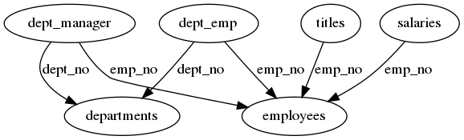
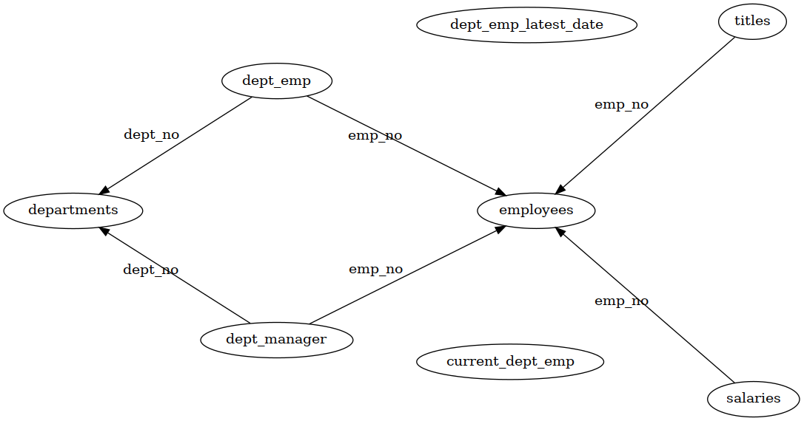
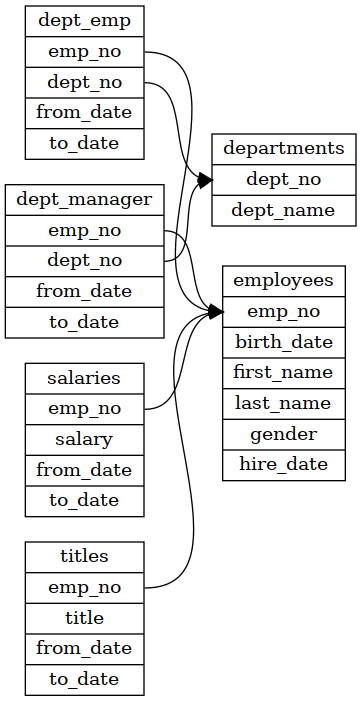
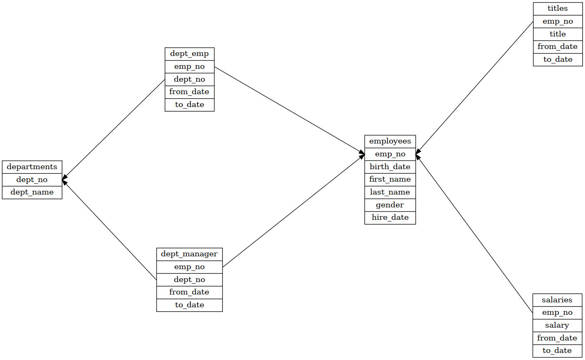

Using the employees database schema available at [datacharmer/test_db](https://github.com/datacharmer/test_db). While the
current implementation does not explicitly support views, they will show in when generating using the simple method
because they are listed by the MySQL/MariaDB `SHOW TABLES` command.

## Simple
### Using the default `dot` layout engine:

```
$ database-graphviz generate simple --dbname=employees ... > schema.gv
$ dot -Tpng schema.gv > schema.png
```



### Using the `sfdp` layout engine

```
$ database-graphviz generate simple --dbname=employees ... > schema.gv
$ dot -Tpng -Ksfdp schema.gv > schema.png
```



## Record
### Using the default `dot` layout engine:

```
$ database-graphviz generate record --dbname=employees ... > schema.gv
$ dot -Tpng schema.gv > schema.png
```



### Using the `sfdp` layout engine

```
$ database-graphviz generate record --dbname=employees ... > schema.gv
$ dot -Tpng -Ksfdp schema.gv > schema.png
```


